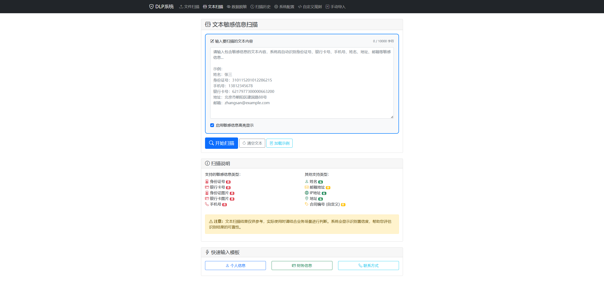
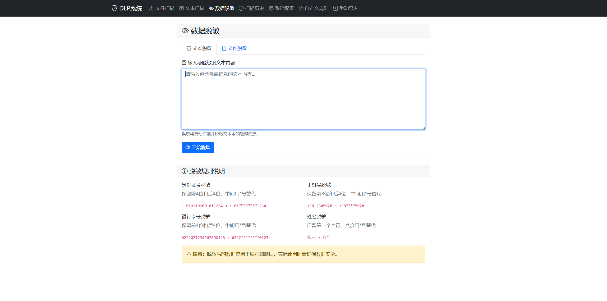
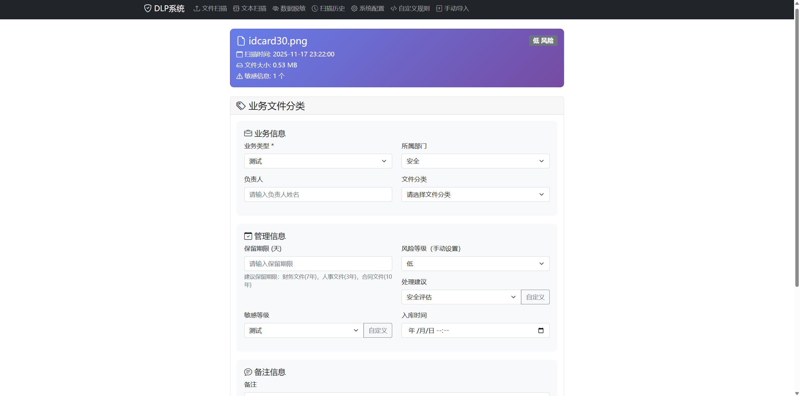
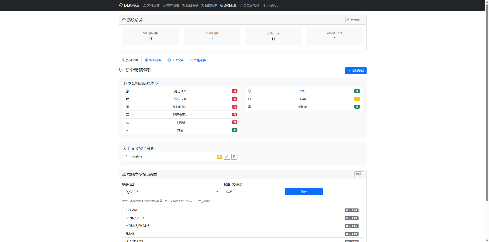
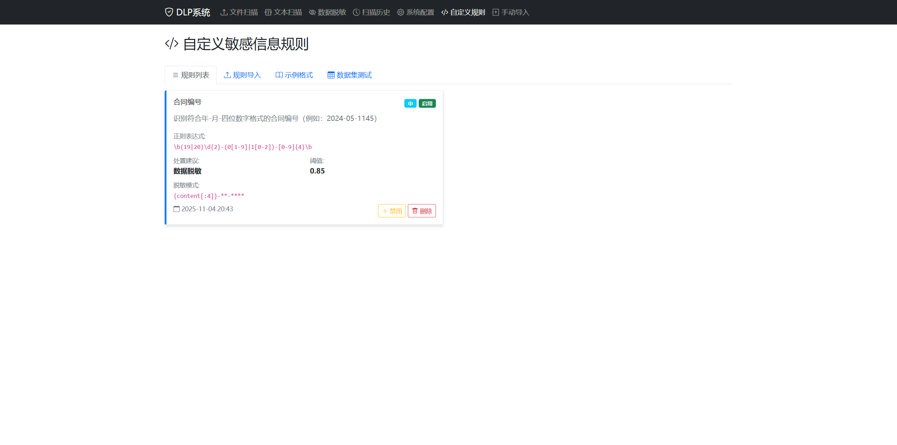
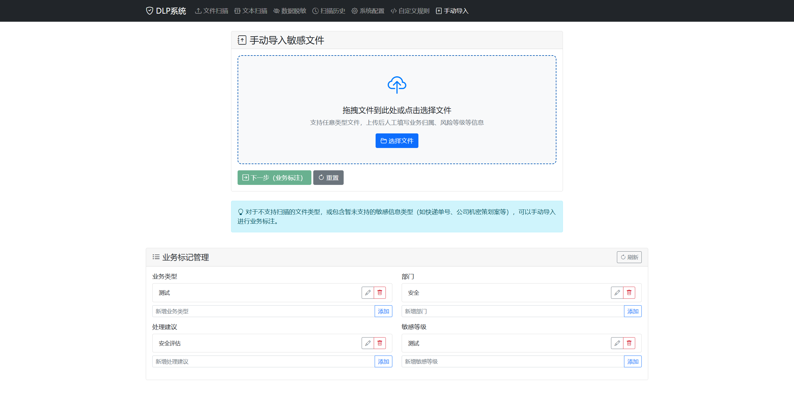
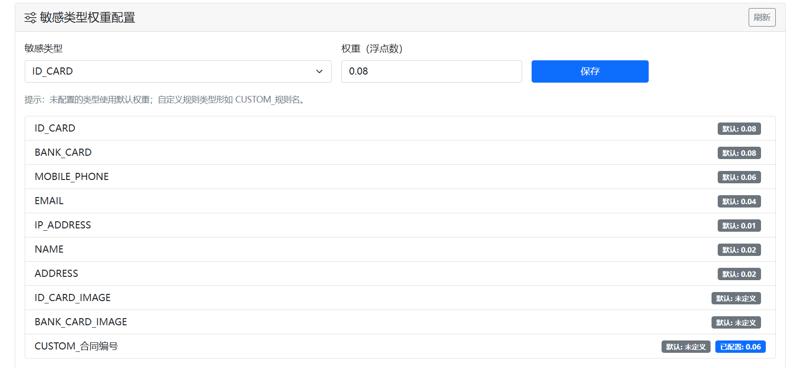

# DLP数据泄露防护系统V1.0

一个基于Python Flask开发的敏感数据识别和防护系统，支持多种文件格式的敏感信息检测、数据脱敏、风险评估等功能。提供web界面可单独使用，同时已将服务封装api可以作为DLP的数据识别的子服务。（画个饼.后续会增加基线监控、阻断响应服务）

## 技术栈
- 后端：Flask 2.x、Flask‑SQLAlchemy、Werkzeug、OpenCV + Tesseract、Pandas、python-docx、PyPDF2 、Flask-Migrate
- 前端：Bootstrap 5、jQuery、HTML5/CSS3
- 识别引擎：自研规则检测 +OCR轻量级的深度学习模型
- 存储：SQLite 默认（可切 MySQL/PostgreSQL）
- 其他：pdfkit + wkhtmltopdf（PDF 导出，可选）、CSV 原生支持
## 功能特性

### 🔍 敏感信息识别
- **身份证号**：支持18位身份证号识别和校验
- **银行卡号**：支持16-19位银行卡号识别和Luhn算法校验
- **手机号**：支持中国大陆手机号识别
- **姓名**：支持中文姓名识别
- **地址**：支持中文地址识别
- **邮箱**：支持邮箱地址识别
- **IP地址**：支持IPv4地址识别
- **身份证图片**：支持身份证图片识别
- **银行卡图片**：支持银行卡图片识别
- 合同编号（此为测试自定义规则留存的用例，非真实业务）

### 📁 文件格式支持
- **文档格式**：PDF、DOCX、TXT
- **数据格式**：JSON、CSV
- **图片格式**：PNG、JPG、GIF、BMP（通过 idcard_ocr API 识别身份证/银行卡图片）

### 🛡️ 安全功能
- **风险评估**：智能风险评估算法，支持5级风险等级（无、低、中、高、极高）
- **权重配置**：可自定义敏感类型权重，灵活调整风险评估
- **数据脱敏**：智能脱敏处理
- **业务分类**：文件业务类型分类
- **手动导入**：支持手动导入文件并设置风险等级
- **文件自动删除**：扫描完成后立即删除上传文件，不保存敏感文件到本地
- **定时清理**：每小时自动清理uploads目录，确保无遗留文件
- **审计日志**：完整的操作记录
- **访问日志**：所有HTTP请求记录到logs目录
- **安全策略**：可配置的安全策略
- **自定义规则**：支持用户自定义敏感信息识别规则

### 🌐 Web界面
- **文件上传**：拖拽上传支持
- **文本扫描**：直接输入文本扫描
- **扫描历史**：历史记录管理
- **系统配置**：代理、性能参数配置
- **自定义规则**：支持JSON/YAML/文本格式的规则导入
- **规则测试**：在线测试自定义规则
- **响应式设计**：支持移动端访问

## 安装部署

### 环境要求
- Python 3.8+
- Flask 2.3+
- SQLite/MySQL/PostgreSQL

### 安装步骤

1. **克隆项目并安装ocr服务依赖**
```bash
git clone <repository-url>
cd mydlp/idcard_ocr
pip install -r requirements.txt
```

2. **安装dlp服务依赖**
```bash
cd mydlp
pip install -r requirements.txt
```

3. 自动启动脚本
```bash
python run.py

#如果ocr启动失败则运行下列命令手动运行ocr服务
cd mydlp/idcard_ocr
python app.py
```

启动脚本会自动：

- 检测并启动 idcard_ocr 服务（图片识别服务，默认端口8088）
- 启动DLP主服务（默认端口5000）
- 配置访问日志到logs目录

### 重要依赖/外部工具

- **idcard_ocr API 服务**：图片识别服务（身份证/银行卡识别）
- **PDF导出**：需安装 wkhtmltopdf（pdfkit 调用，可选）

Windows示例：
- wkhtmltopdf: https://wkhtmltopdf.org/downloads.html

###  访问系统
打开浏览器访问：http://localhost:5000

**注意**：
- 如果 idcard_ocr 服务未启动，图片识别功能将不可用，系统会返回"未知类别"
- 访问日志会自动记录到 `logs/access_YYYY-MM-DD.log` 文件
- idcard_ocr 服务日志记录在 `logs/idcard_ocr_stdout.log` 和 `logs/idcard_ocr_stderr.log`
- **重要**：出于安全原则，所有上传文件在扫描完成后会立即删除，不会保存到服务器本地
- 文件路径信息会保存在数据库中，便于追溯和审计

### Docker部署

**使用 docker-compose（推荐）**
```bash
# 启动所有服务（包括 idcard_ocr）
docker-compose up -d

# 查看日志
docker-compose logs -f

# 停止服务
docker-compose down
```

**单独构建运行**
```bash
# 先启动 idcard_ocr 服务（在 idcard_ocr 目录）
cd idcard_ocr
docker build -t idcard-ocr .
docker run -p 8088:8088 idcard-ocr

# 再启动 DLP 系统（在项目根目录）
cd ..
docker build -t dlp-system .
docker run -p 5000:5000 -e IDCARD_OCR_API_URL=http://host.docker.internal:8088/predict dlp-system
```

**注意**：
- docker-compose 会自动配置服务间的网络连接
- 单独运行时需要确保 idcard_ocr 服务可访问，并配置正确的 API URL
- Docker容器中的文件也会自动删除，uploads目录仅用于临时存储
- 数据库文件保存在instance目录中，建议定期备份

## 使用说明

### 1. 文件扫描
1. 点击"文件扫描"菜单

2. 拖拽或选择文件上传

3. 系统自动识别敏感信息

4. 查看扫描结果和风险评估

   

### 2. 文本扫描
1. 点击"文本扫描"菜单

2. 输入要扫描的文本内容

3. 点击"开始扫描"

4. 查看识别结果

   

### 3. 数据脱敏
1. 点击"数据脱敏"菜单

2. 上传文件或输入文本

3. 系统自动进行脱敏处理

4. 下载脱敏后的内容

   

### 4. 业务分类
1. 在扫描结果页面点击"业务分类"

2. 填写业务信息

3. 设置保留期限和处理建议

4. 保存分类信息

   

   

### 5. 系统配置
1. 点击"系统配置"菜单

2. 配置安全策略

3. 设置代理和性能参数

4. 保存配置

   

### 6. 自定义规则
1. 点击"自定义规则"菜单

2. 添加单个规则或批量导入

3. 支持JSON、YAML、文本三种格式

4. 在线测试规则效果

5. 管理规则的启用/禁用

   

### 7. 手动导入文件
1. 点击"手动导入"菜单

2. 填写文件信息

3. 手动设置风险等级和业务分类

4. 保存到扫描历史

   

### 8. 敏感类型权重配置
1. 点击"系统配置"菜单

2. 找到"敏感类型权重配置"部分

3. 选择敏感类型，设置权重值

4. 权重影响风险评估分数计算

   

## 配置说明

### 敏感信息配置
在 `config.py` 中可以配置：
- 敏感信息类型
- 识别阈值
- 风险等级
- 处置建议

### 文件上传配置
- 最大文件大小：16MB
- 支持的文件类型：pdf, docx, txt, json, csv, png, jpg, gif, bmp

### idcard_ocr API 配置
- 默认地址：`http://localhost:8088/predict`
- 可通过环境变量 `IDCARD_OCR_API_URL` 自定义
- 超时时间：默认 10 秒，可通过环境变量 `IDCARD_OCR_API_TIMEOUT` 自定义

### 风险评估配置
- **风险等级**：无（0分）、低（0.01-10分）、中（10.01-30分）、高（30.01-70分）、极高（70.01-100分）
- **权重配置**：可在系统配置页面自定义各敏感类型的权重
- **组合规则**：多种敏感类型组合时风险分数显著提高
- **特殊规则**：姓名+地址组合至少为中等风险；仅包含低敏感类型（姓名、IP、地址）且只有一种时视为无风险

### 文件管理配置
- **自动删除**：所有上传文件在扫描完成后立即删除，不保存到本地
- **路径记录**：文件路径信息保存在数据库中（file_path字段），便于追溯
- **定时清理**：每小时自动清理uploads目录中的所有文件（作为备份机制）
- **安全设计**：确保敏感文件不会在服务器上长期存储

### 日志配置
- **访问日志**：自动记录到 `logs/access_YYYY-MM-DD.log`
- **服务日志**：idcard_ocr服务日志记录在 `logs/idcard_ocr_stdout.log` 和 `logs/idcard_ocr_stderr.log`
- **日志轮转**：访问日志文件最大10MB，保留5个备份

### 代理配置
支持HTTP/HTTPS代理设置，用于网络请求。

## API接口

详细的API文档请参考 [API_DOCUMENTATION.md](API_DOCUMENTATION.md)

### 主要API端点
- `GET /api/scan_stats` - 获取扫描统计信息
- `GET /api/sensitive_types` - 获取敏感信息类型列表
- `GET /api/weights` - 获取敏感类型权重配置
- `POST /api/weights/save` - 保存敏感类型权重
- `POST /api/upload` - 文件上传和扫描
- `POST /api/manual_upload` - 手动导入文件
- `GET /api/presets` - 获取预设选项
- `POST /api/presets` - 添加预设选项
- `GET /api/custom_rules` - 获取自定义规则列表
- `GET /api/history/<scan_id>` - 获取扫描历史详情
- `DELETE /api/history/<scan_id>` - 删除扫描记录

## 数据库结构

### 主要表结构
- `scan_history`：扫描历史记录
- `sensitive_items`：敏感信息项目
- `security_policies`：安全策略配置
- `system_config`：系统配置
- `masking_rules`：脱敏规则
- `business_files`：业务文件分类
- `audit_logs`：审计日志

## 安全建议

1. **生产环境部署**
   - 修改默认密钥
   - 使用HTTPS
   - 配置防火墙
   - 定期备份数据

2. **敏感信息处理**
   - 定期清理扫描历史
   - 设置访问权限
   - 监控异常操作

3. **系统维护**
   - 定期更新依赖
   - 监控系统性能
   - 查看审计日志

## 技术架构

### 后端技术栈
- **Flask**：Web框架
- **SQLAlchemy**：ORM数据库操作
- **Pandas**：数据处理
- **PyPDF2**：PDF处理
- **python-docx**：Word文档处理
- **idcard_ocr API**：身份证/银行卡图片识别服务（基于深度学习模型）

### 前端技术栈
- **Bootstrap 5**：UI框架
- **jQuery**：JavaScript库
- **响应式设计**：移动端适配

## 开发说明

### 项目结构
```
mydlp/
├── app.py                 # 主应用文件
├── config.py              # 配置文件
├── models.py              # 数据库模型
├── requirements.txt       # 依赖包
├── core/                  # 核心模块
│   └── detector.py        # 敏感信息检测
├── processors/            # 文件处理器
│   └── file_processor.py   # 文件处理
├── routes/                # 路由
│   └── main.py           # 主路由
└── templates/            # 模板文件
    ├── index.html        # 首页
    ├── upload.html       # 文件上传
    ├── scan_result.html  # 扫描结果
    └── ...
```

### 扩展开发
1. **添加新的敏感信息类型**
   - 在 `core/` 目录下新增 `xxx.py` 并实现 `is_xxx`/`mask_xxx`
   - 无需在 `config.py` 维护重复正则；`detector.py` 只做编排
2. **支持新的文件格式**
   - 在 `processors/` 下创建处理器（如 `yaml_processor.py`）并实现批量识别/脱敏
3. **自定义脱敏/规则**
   - 使用“自定义规则”页面添加/导入；可配置 `validation_function`（如 luhn/id_checksum/mobile_prefix）和 `masking_pattern`

## 许可证

本项目采用 Apache-2.0 许可证。

## 贡献指南

欢迎提交Issue和Pull Request来改进项目。

## 联系方式

如有问题或建议，请通过以下方式联系：
- 提交Issue
- 发送邮件

---

**注意**：本系统仅用于学习和研究目的，请遵守相关法律法规，不得用于非法用途。

